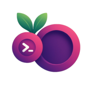

# 🚀 FlexiBerry

**🌟 FlexiBerry** is a comprehensive API testing framework that supports a wide range of testing scenarios, including functional, load, security, data comparison, response validation, unit, and end-to-end testing.

## ✨ Features

- **Comprehensive Testing**: Supports various types of API testing including functional, load, and security testing. 🔍
- **User-Friendly Interface**: Designed with a minimalistic UI for ease of use. 🖥️
- **Customizable Test Suites**: Create and manage test suites tailored to your specific needs. ⚙️
- **Real-Time Results**: Get immediate feedback on your API tests. ⏱️
- **Integration Support**: Easily integrate with CI/CD pipelines for automated testing. 🔗

## 📦 Usage

1. Install FlexiBerry using the package manager of your choice. 📥
2. Configure your API endpoints in the settings. ⚙️
3. Create test cases using the provided templates. 📝
4. Run your tests and view the results in real-time. 📊

## 🛠️ Developing

To get started with developing FlexiBerry, follow our self-hosting documentation to set up your development environment. 📚

## 🤝 Contributing

We welcome contributions! Please follow these steps to contribute:

1. Fork the repository. 🍴
2. Create a new branch for your feature or bug fix. 🌿
3. Make your changes and commit them. 💻
4. Open a pull request with a description of your changes. 📬

Please read the [CONTRIBUTING](CONTRIBUTING.md) file for more details on our code of conduct and the process for submitting pull requests.

## 🔄 Continuous Integration

We use GitHub Actions for continuous integration. Check out our build workflows to see how we ensure code quality. ✅

## 📜 Changelog

See the [CHANGELOG](CHANGELOG.md) file for details on the latest updates and changes.

## 📝 License

This project is licensed under the MIT License — see the [LICENSE](LICENSE.md) file for details.

## 👥 Authors

This project owes its existence to the collective efforts of all those who contribute — contribute now! 🙌

## 💬 Support

For support, please reach out via our [Discord](link_to_discord) or [GitHub Discussions](link_to_github_discussions).

---

© 2025 FlexiBerry, Inc.
