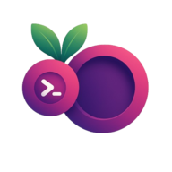

<p align="center">
  
</p>

<h1 align="center">FlexiBerry</h1>

<h2 align="center"> The Developer-First HTTP Client Built for Sequential API Workflows.
</h2>
<p align="center">
  <a href="https://flexiberry.dev"></a> <a href="https://www.npmjs.com/package/@flexiberry/cli"></a> <a href="https://open-vsx.org/extension/flexiberry/vscode-berry-extension"></a> <a href="https://flexiberry.dev"></a> <a href="./LICENSE.md"></a> <a href="./CONTRIBUTING.md"></a> <a href="https://nodejs.org"></a> <a href="https://www.typescriptlang.org"></a>
</p>

<br/>

<p align="center">
  
  <br/>
  <em>FlexiBerry Web App in action — Visualizing sequential multi-API workflows & real-time assertions.</em>
</p>

<br/>

<p align="center">
  <a href="https://flexiberry.dev">🌐 Website</a> · <a href="https://docs.flexiberry.dev">📖 Docs</a> · <a href="#-installation">📦 Installation</a> · <a href="#-quick-start">⚡ Quick Start</a> · <a href="#-features">✨ Features</a> · <a href="#-contributing">🤝 Contributing</a> · <a href="#-support">💬 Support</a>
</p>

---

## 💡 The Purpose & The Core Problem

### **API Testing shouldn't feel like writing an entire automation app.**

Most API clients either force you into heavy, click-and-point GUIs that make automation a nightmare, or make you write endless JavaScript snippets just to pass an ID from one request to the next.

**Flexiberry fixes this.** It bridges the gap between a standard **HTTP Client** and a full **API Testing Framework**—uniquely specializing in **Sequential, Dependent Multi-API Workflows**. It introduces a clean, readable syntax (`.berry`) designed specifically to track dependencies and chain multi-API sequences straight out of the box.

---

## 🔄 How It Works: Multi-API Sequences

When APIs are connected, your tests should be too. Flexiberry effortlessly pipes data from an upstream response directly into a downstream request.

### **Example: The Petstore Sequence**

To test a "Get Pet By ID" endpoint, you first need to create the pet and catch its generated ID. Here is how easily Flexiberry handles it:

```berry
Api POST #addPet
Url https://petstore.swagger.io/v2/pet
Header
- Content-Type: 'application/json'
- Accept: 'application/json'
Body JSON `
{
  "id": 1,
  "{{category}}": {
    "id": 1,
    "name": "dog"
    },
    "name": "doggie",
    "photoUrls": [
      "http://localhost/"
      ],
      "tags": [
        {
          "id": 0,
          "name": "pet"
        }
        ],
        "status": "available"
}
`
Api GET #getPetById
Url https://petstore.swagger.io/v2/pet/{{petId}}
Header
- Accept: 'application/json'


Task add new pet and find
Step  Call Api addPet 
    Capture
        - id: response.id 
        - status: response.status
    Check
        - $.status == 200 OR $.status == 201
        - $.body != null
        - id != null
        - status != null

Step Call Api getPetById
    Params
        - petId: Step.1.id

    Capture
    - id: response.id
    - status: response.status

    Check
    - $.status == 200
    - $.body != null
    - id == Step.1.id
```

---

## ✨ Features

* **🔗 Seamless Request Chaining**: Capture variables (like authentication tokens, user IDs, or entity keys) from one API response and inject them directly into subsequent requests.
* **✍️ Human-Readable `.berry` Syntax**: Write your HTTP requests, variable captures, and assertions in a clean, declarative domain-specific language (DSL) that lives right alongside your code.
* **⚙️ True Dual-Purpose Engine**: Use it as a quick **HTTP Client** to scratchpad daily endpoints during development, or scale it into a robust **Automated Test Suite** with powerful assertions.
* **🚀 Zero-Dependency & CI/CD Ready**: Designed to be lightweight and blistering fast. Run your `.berry` workflow files natively in your terminal or embed them cleanly into your GitHub Actions / CI pipelines.
* **📁 Environment Variables Support**: Easily switch between `local`, `staging`, and `production` environments without rewriting your workflow files.

---

## 🎯 Who is Flexiberry For?

* **Backend Developers** who want a fast, local HTTP client that can handle modern, state-dependent API flows without the bloat of UI-heavy apps.
* **QA & Automation Engineers** looking for a zero-boilerplate, git-friendly framework where test logic is transparent, reviewable, and easily merged.
* **Product Teams** looking to document and validate end-to-end integration flows (e.g., *Signup ➡️ Authenticate ➡️ Create Profile ➡️ Fetch Dashboard*).

---

## 📦 Installation

### Prerequisites

- **Node.js** `v18+`
- **npm** or **pnpm**

### npm Packages & Extensions

You can install the official published packages directly from npm or VS Code Marketplace:

* 🌐 **FlexiBerry CLI**: [@flexiberry/cli on npm](https://www.npmjs.com/package/@flexiberry/cli)
* 🧠 **BerryCore Engine**: [@flexiberry/berrycore on npm](https://www.npmjs.com/package/@flexiberry/berrycore)
* 🔌 **VS Code Extension**: [FlexiBerry on Open VSX](https://open-vsx.org/extension/flexiberry/vscode-berry-extension)

```bash
# Install the CLI globally
npm install -g @flexiberry/cli

# Or install the core engine to build programmatic test runners
npm install @flexiberry/berrycore
```

### Local / Monorepo Installation

Install the CLI globally from the local workspace:

```bash
# Step 1 — Build the CLI package
cd packages/cli
npm run build

# Step 2 — Install globally
sudo npm i -g .
```

---

## ⚡ Quick Start

```bash
# 1. Clone the repository
git clone https://github.com/flexiberry/flexiberry.git
cd flexiberry

# 2. Install dependencies
npm install

# 3. Launch the CLI
flexiberry
```

Once inside the CLI:
1. Configure your API endpoints
2. Create test cases from the built-in templates
3. Run your suite and watch results stream in real-time

---

## 🛠️ Development Setup

Want to hack on FlexiBerry itself? Here's how to get started:

```bash
# Install all workspace dependencies
npm install

# Run the CLI in development mode
cd packages/cli && npm run dev
```

Refer to our [self-hosting documentation](https://docs.flexiberry.dev/self-hosting) for a full environment setup guide.

---

## 🤝 Contributing

We warmly welcome contributions of all kinds — bug fixes, new features, documentation improvements, and more.

```
1. Fork the repository
2. Create your branch:  git checkout -b feat/your-feature
3. Commit your changes: git commit -m 'feat: add your feature'
4. Push to the branch:  git push origin feat/your-feature
5. Open a Pull Request
```

Please read [CONTRIBUTING.md](CONTRIBUTING.md) for our code of conduct and PR guidelines.

---

## 🔄 Continuous Integration

FlexiBerry uses **GitHub Actions** for automated builds and quality checks on every commit and pull request.

---

## 📜 Changelog

All notable changes are documented in [CHANGELOG.md](CHANGELOG.md).

---

## 📝 License

Distributed under the **MIT License**. See [LICENSE.md](LICENSE.md) for details.

---

## 💬 Support

| Channel | Link |
|---|---|
| 🌐 Website | [flexiberry.dev](https://flexiberry.dev) |
| 📖 Docs | [docs.flexiberry.dev](https://docs.flexiberry.dev) |
| 💬 Discord | [Join our server](https://discord.flexiberry.dev) |
| 🐛 Bug Reports | [GitHub Issues](https://github.com/flexiberry/flexiberry/issues) |
| 💡 Discussions | [GitHub Discussions](https://github.com/flexiberry/flexiberry/discussions) |

---

<div align="center">

Made with ❤️ by the FlexiBerry community · [flexiberry.dev](https://flexiberry.dev) · © 2025 FlexiBerry, Inc.

</div>
